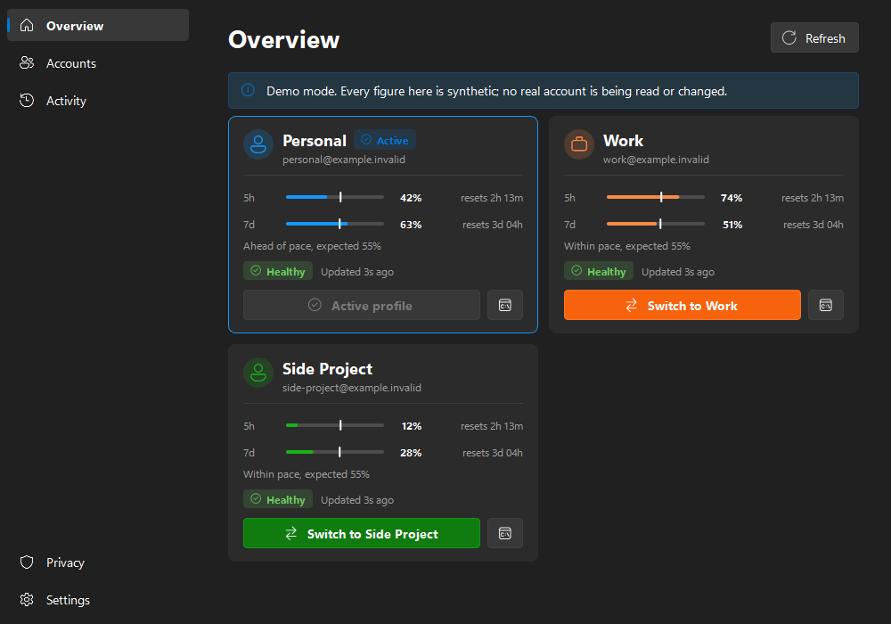
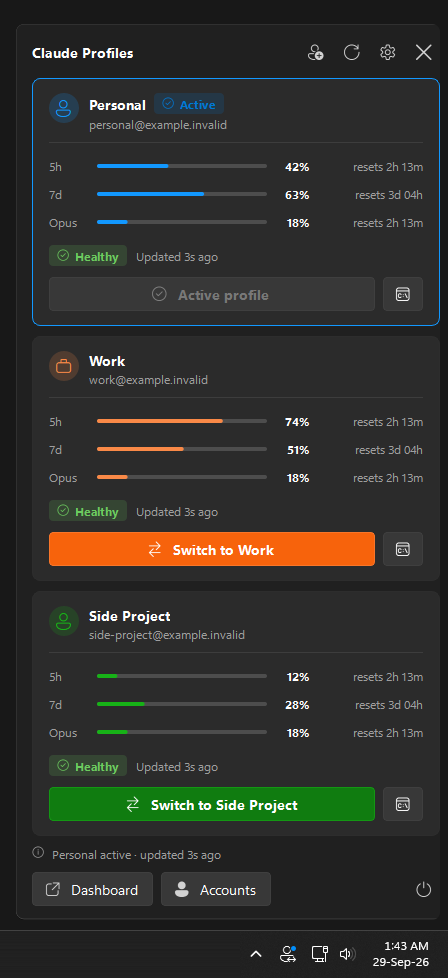

<div align="center">


# Claude Profiles

**Juggle as many Claude Code accounts as you have on Windows, without the log-out/log-in dance.**
See every account's quota at a glance, switch in one click, or open a terminal bound to any of them.

[](https://github.com/kevinabouhanna/claude-profiles-windows/releases/latest)
[](https://github.com/kevinabouhanna/claude-profiles-windows/actions/workflows/ci.yml)


**[⬇️ Download the installer for Windows](https://github.com/kevinabouhanna/claude-profiles-windows/releases/latest/download/ClaudeProfiles-Setup.exe)** · [Website](https://kevinabouhanna.github.io/claude-profiles-windows/) · [All releases](https://github.com/kevinabouhanna/claude-profiles-windows/releases)



</div>

---

## Sound familiar?

If you use [Claude Code](https://docs.anthropic.com/en/docs/claude-code) with more than one account, such as
a personal subscription, a work seat, a client's organisation, or a spare account for when you hit
your limits, you have probably hit some of these:

- **Claude Code only knows one account at a time.** Changing account means `/logout`, `/login`, a
  browser round-trip, and remembering which email you are in right now.
- **You hit the 5-hour limit halfway through a task**, and you cannot tell which of your *other*
  accounts has headroom without switching to each one first.
- **Usage is invisible until it is a problem.** Your 5-hour and 7-day limits are checked one account at
  a time, so you find out you are at 95% when Claude stops answering.
- **You want several accounts at once**: one terminal on the work account, another on a personal
  one, without one login clobbering the other.
- **The tools that exist don't fit Windows.** [claude-swap](https://github.com/realiti4/claude-swap)
  solves the credential side well, but it is a CLI. The polished multi-profile usage trackers are
  macOS apps.

**Claude Profiles is a small Windows tray app that fixes all of the above.** It puts every account's
usage in your notification area, however many you have. Switching is one click, and it can open a
terminal locked to any account. It never touches your credentials itself.

<div align="center">

<br><sub>The real tray icon and flyout on Windows 11. Left-click the icon to open it. Demo data.</sub>
</div>

## Features

| | |
|---|---|
| 📊 **Every account at a glance** | 5-hour and 7-day usage with reset countdowns, data age, and login health, plus any model-specific limit claude-swap reports for an account. |
| 📏 **Know your pace** | A white line on the 5-hour and 7-day bars marks where you would be if you spent the quota evenly. Fill past the line means you are burning through it; short of it, you have room. |
| 🔁 **One-click switching** | Changes the account Claude Code uses for **new** sessions. The controls lock while the switch runs, and a Windows notification confirms the result. |
| 🖥️ **Isolated sessions** | Open a Claude Code terminal bound to one account *without* changing the global active account, so you can run several side by side. |
| ➕ **As many accounts as you have** | Two, three or ten: every account registered with claude-swap gets a card, a colour, a menu entry and a shortcut. Name them whatever you like: `personal`, `work`, `client-acme`. |
| 🪟 **A proper Windows tray app** | Monochrome Fluent glyph that follows your taskbar theme, with a coloured badge for the active profile. Left-click for the flyout; right-click for a native menu. |
| 🧭 **Full dashboard** | WinUI-style navigation with Overview, Accounts, Activity, Privacy and Settings pages. It follows your Windows accent colour and uses Segoe Fluent Icons. |
| 🧑‍💻 **Guided account setup** | *Add an account* walks you through signing in and naming each account, and shows exactly which address you are about to register. Rename accounts at any time. |
| 🔔 **Threshold alerts** *(opt-in)* | Notifies you when usage crosses a warning or critical level. It fires once per crossing and re-arms after the reset. |
| ⌨️ **Global shortcuts** *(opt-in)* | `Ctrl+Alt+1` to `Ctrl+Alt+9` switch to your first nine accounts, in the order the Overview shows them. |
| ⚡ **Smart refresh** | Opening the flyout refreshes it. Polling speeds up to 30 s while a window is visible and backs off automatically after errors. |
| 🚀 **Starts with Windows** | Adds a Start menu and Startup shortcut. No registry keys are written. |
| 🧪 **Demo mode** | `--mock` runs the whole UI on synthetic data. Useful for trying it before you set anything up. |
| 🔒 **Local-only by design** | No network code, no telemetry, and no credential access. See [Privacy and security](#privacy-and-security). |

### What it can and cannot switch

| | |
|---|---|
| ✅ Switches | The account Claude Code uses for **new** sessions, via claude-swap. |
| ✅ Isolated sessions | `cswap run` opens a terminal bound to one account, leaving the global profile alone. |
| ❌ Does **not** switch | Your browser session on claude.ai. Signing in there is separate and unaffected. |
| ❌ Does **not** touch | Running Claude Code processes, VS Code, terminals, or open chats. Nothing is ever killed for you. |
| ⚠️ Needs a nudge | An already-open VS Code Claude panel may still show the previous account. Close and reopen that panel. |

## How it works

Claude Profiles is a presentation layer on top of
**[claude-swap](https://github.com/realiti4/claude-swap)** (`cswap`), which does the actual account
storage, switching and quota fetching. **The installer includes claude-swap**, so there is nothing
else to set up. The app runs that bundled `cswap` as a separate program, parses its JSON output,
and draws it.

```
 Tray icon / flyout / dashboard
              │
        ProfileService ── polling, switching, activity log
              │
         CswapClient   ── allowlisted commands only, never a shell
              │
            cswap      ── owns your credentials; Claude Profiles never does
```

This split is deliberate: the app itself contains no OAuth logic, no token parsing, no credential
backups, and no writes to `.credentials.json`. The bundled claude-swap is pinned to the version the
app was tested against, and is updated when you install a newer Claude Profiles. See [`docs/architecture.md`](docs/architecture.md) for the
details.

---

## Getting started

### Prerequisites

- Windows 10 or 11 (64-bit)
- [Claude Code](https://docs.anthropic.com/en/docs/claude-code)

That's all. claude-swap comes with the installer.

### 1. Install Claude Profiles

Download **[`ClaudeProfiles-Setup.exe`](https://github.com/kevinabouhanna/claude-profiles-windows/releases/latest/download/ClaudeProfiles-Setup.exe)**
from the [latest release](https://github.com/kevinabouhanna/claude-profiles-windows/releases/latest) and run it.

- It includes claude-swap, so this is the only thing to install.
- It installs for your user only, to `%LOCALAPPDATA%\Programs\Claude Profiles`. **No administrator
  rights are needed.**
- It adds a Start menu entry and an uninstaller under *Settings > Apps*.
- To upgrade, run a newer installer. It closes the running app and replaces it, and the bundled
  claude-swap with it, in place.
- Optionally, tick **Add the bundled claude-swap (cswap) to my PATH** to use `cswap` from a
  terminal too. It is off by default and removed again on uninstall.

The tray icon appears in the notification area. Left-click it for the compact view.

> **"Windows protected your PC"?** The installer is not code-signed yet, so SmartScreen warns about
> it. Choose **More info**, then **Run anyway**. Every release is built by GitHub Actions from the
> tagged source, with SHA-256 checksums and a
> [build provenance attestation](https://docs.github.com/en/actions/security-for-github-actions/using-artifact-attestations)
> you can check yourself:
>
> ```powershell
> gh attestation verify ClaudeProfiles-Setup.exe --repo kevinabouhanna/claude-profiles-windows
> ```

<details>
<summary>Prefer not to install? Use the portable zip or run from source</summary>

**Portable:** download `ClaudeProfiles-X.Y.Z-win-x64-portable.zip` from the same release, unzip it
anywhere, and run `ClaudeProfiles.exe`.

**From source** (Python 3.12 or newer). A source checkout does not include claude-swap, so install
it first with `uv tool install claude-swap`:

```powershell
git clone https://github.com/kevinabouhanna/claude-profiles-windows.git
cd claude-profiles-windows

uv venv
uv pip install -e .

.venv\Scripts\python.exe -m claude_profiles
```
</details>

> **Just want a look first?** Run `ClaudeProfiles.exe --mock` (or `python -m claude_profiles --mock`
> from source) to explore everything with synthetic data. No accounts are read or changed.

Windows 11 hides new tray icons by default. To keep this one visible, go to **Settings >
Personalisation > Taskbar > Other system tray icons** and switch on *Claude Profiles*.

### 2. Register your accounts

**You can do this inside the app.** Choose **Add an account** from the tray menu or the flyout. For
each account you use, as many as you have:

1. **Sign in.** The button opens a terminal running Claude Code. Sign in there (type `/login` to change
   account), then close it. The wizard notices the sign-in on its own.
2. **Name it and save it.** The wizard shows which address Claude Code is signed in as right now.
   Check it, give it a short name such as `personal`, `work` or `client-acme`, and save.

Repeat for the next account. To rename one later, use the **Accounts** page, which also lists every
account claude-swap knows about.

<details>
<summary>The equivalent terminal commands, if you prefer</summary>

These need `cswap` on your PATH: tick the installer's PATH option, or install claude-swap yourself.

```powershell
claude                      # sign in as the first account, then exit
cswap add --alias personal

claude                      # sign in as the next account, then exit
cswap add --alias work      # ...and so on, one alias per account

cswap list                  # every account should appear with its alias
cswap alias 3 client-acme   # to rename an existing account
```
</details>

Claude Profiles stores no account identifiers of its own. The list of accounts, their names and
their email addresses are read from `cswap list --json` each time, and never written into source
or config.

### Demo scenarios

```powershell
& "$env:LOCALAPPDATA\Programs\Claude Profiles\ClaudeProfiles.exe" --mock
& "$env:LOCALAPPDATA\Programs\Claude Profiles\ClaudeProfiles.exe" --scenario work_reauth
```

Scenarios: `healthy`, `two_accounts`, `work_reauth`, `work_stale`, `work_unavailable`, `high_usage`, `no_accounts`,
`unknown_schema`.

---

## Settings

| Setting | Default | Notes |
|---|---|---|
| Refresh interval | 120 s | Used while the app is in the tray. Polls never overlap and back off automatically after errors. |
| Launch at Windows sign-in | **On** | Creates a shortcut in your Startup folder. **No registry keys are ever written.** Turning it off deletes the shortcut. |
| Threshold notifications | Off | Fires on an upward crossing only, and re-arms after a reset. |
| Global shortcuts | Off | `Ctrl+Alt+1` to `Ctrl+Alt+9`, one per account in Overview order. Registered only when enabled. |

Switch confirmations always appear, regardless of the notification setting, because they are the
direct result of something you clicked.

### When usage refreshes

You should rarely need the Refresh button:

- **Opening the flyout or the dashboard refreshes it**, unless a reading arrived in the last 10 seconds.
- **Polling speeds up while you are looking.** With a window on screen the interval drops to 30
  seconds, then returns to your configured interval once everything is hidden.
- **After a switch**, state is re-read immediately.

## When an account needs re-authentication

If claude-swap reports `token_expired`, `relogin_required`, or `no_credentials`, the card shows
**Re-authentication required**. The fix is manual by design:

1. Open the **Accounts** page and press **Open a terminal to sign in to Claude Code**.
2. Sign in as that account, close the terminal, and press **Re-check**.
3. Register it again under the same name to refresh the stored slot.

The equivalent by hand is `claude` to sign in, then `cswap add --alias <alias>`. The app will never
try to automate authentication in the background.

---

## Privacy and security

- **Local only.** The app opens no network connections. Its only external interaction is running
  its bundled `cswap` and parsing the JSON it prints. Fetching usage is claude-swap's job, and the
  bundled copy has its PyPI update check turned off.
- **No credential access.** `%USERPROFILE%\.claude\.credentials.json`, `.claude-swap-backup\`, and
  Claude Code session files are never read, written, copied, exported, or backed up.
- **Allowlisted commands.** Only `cswap list`, `status`, `switch`, `run`, `add`, and `alias` can be
  invoked. There is no free-form command path, argv is always a list, and a shell is never used.
  `remove`, `purge`, `export`, `import`, `add-token`, and `config` are all refused.
- **Setup is not authentication.** `add` only records the account Claude Code is *already* signed
  in as. Signing in stays an interactive step you perform yourself.
- **No raw output is logged.** `cswap` stdout and stderr never reach a log or the UI. Only parsed,
  redacted error fields do.
- **Redaction everywhere.** Anything written to disk passes through a scrubber for API keys, JWTs,
  bearer tokens and `token=`/`secret=` assignments. Email addresses are masked.
- **No telemetry**, analytics, crash reporting, cloud sync, or remote configuration.
- **Restricted storage.** `%LOCALAPPDATA%\ClaudeProfiles\` is locked to your user account on
  creation. It holds only UI preferences and a capped activity history.

The in-app **Privacy** page says the same, and has **Open data folder** and **Clear local activity
history** buttons. See [`docs/privacy.md`](docs/privacy.md) for the full data inventory.

---

## Uninstalling

Use *Settings > Apps > Installed apps > Claude Profiles > Uninstall*. It stops the app and removes
the program, its Start menu and Startup shortcuts, and its icon cache. Your preferences in
`%LOCALAPPDATA%\ClaudeProfiles` are kept. Delete that folder, or use **Clear local activity
history** on the Privacy page first, if you want them gone too. Your registered accounts, which
claude-swap keeps in `%USERPROFILE%\.claude-swap-backup`, are not touched.

---

## Releases and versioning

Claude Profiles uses [Semantic Versioning](https://semver.org/), and every release is listed in
[`CHANGELOG.md`](CHANGELOG.md). Pushing a `vX.Y.Z` tag makes GitHub Actions test, build, verify,
attest and publish the installer and portable zip. No release binary is built on a personal
machine. The full process is in [`docs/releasing.md`](docs/releasing.md).

## Building it yourself

The packaged build behaves like an ordinary Windows application: a windowed binary with its own
icon and version details that never opens a console. With [Inno Setup 6](https://jrsoftware.org/isinfo.php)
installed (`winget install JRSoftware.InnoSetup`):

```powershell
uv pip install -r requirements-dev.txt
powershell -ExecutionPolicy Bypass -File tools\build_release.ps1
uv pip install --require-hashes -r tools\cswap\requirements.txt   # the claude-swap to bundle
powershell -ExecutionPolicy Bypass -File tools\build_release.ps1
# -> release\ClaudeProfiles-Setup-X.Y.Z.exe, the portable zip, and SHA256SUMS.txt
```

The script renders the icon and freezes the app with PyInstaller. It then freezes the pinned
claude-swap ([`cswap.spec`](cswap.spec)) into the app's `cswap` folder and writes
`THIRD-PARTY-NOTICES.txt`. It runs `tools\verify_build.py` against the result, then packs the zip
and compiles [`installer/ClaudeProfiles.iss`](installer/ClaudeProfiles.iss).

<details>
<summary>Why the build is set up this way</summary>

- **One folder, not one file.** A one-file build re-extracts ~45 MB to a temp directory on every
  launch and leaves a bootloader process beside the real one.
- **The icon is rendered before the build.** Drawing it needs a `QPixmap`, and creating one without
  a `QGuiApplication` aborts the process. Inside a `.spec` that looks like PyInstaller crashing
  at the PYZ stage with no error.
- **`verify_build.py` is not optional.** A broken build can still look healthy from the outside,
  so it checks that the app reached its own code, not just that a process exists.
- **uv's `pythonw.exe` is not windowed.** A `.venv` created by uv ships a `pythonw.exe` that is a
  console-subsystem trampoline, so running the app through it opens a terminal. The app detects
  this and points its shortcuts at the installed build, or at a genuinely windowed interpreter.
</details>

## Development

```powershell
uv pip install -r requirements-dev.txt
.venv\Scripts\python.exe -m pytest -q
.venv\Scripts\python.exe -m ruff check .

# Optional: check the live claude-swap contract. Read-only; never switches,
# adds or aliases anything. Worth running after upgrading claude-swap.
.venv\Scripts\python.exe -m pytest --run-integration -m integration
```

See [`docs/development.md`](docs/development.md) and [`docs/architecture.md`](docs/architecture.md).
Issues and pull requests are welcome.

---

## Credits

Claude Profiles would not exist without these projects. Thank you to their authors.

- **[realiti4/claude-swap](https://github.com/realiti4/claude-swap)** (MIT) is the engine underneath.
  It handles account storage, switching, isolated sessions and quota fetching. The installer
  bundles it, unmodified apart from its self-update check, as a separate `cswap.exe` that Claude
  Profiles runs as a subprocess. If this app is useful to you, go star that repo.
- **[jens-duttke/usage-monitor-for-claude](https://github.com/jens-duttke/usage-monitor-for-claude)**
  (MIT) was the reference for Windows tray behaviour, adaptive polling and privacy practice.
  **No code copied.**
- **[hamed-elfayome/Claude-Usage-Tracker](https://github.com/hamed-elfayome/Claude-Usage-Tracker)**
  (MIT) was the UX reference for presenting multiple profiles. It is a macOS Swift app; **no code
  ported**.
- Built with **[PySide6 / Qt for Python](https://doc.qt.io/qtforpython-6/)** and packaged with
  **[PyInstaller](https://pyinstaller.org/)**.

No source from these projects is copied into this repository. The installer ships claude-swap and
its dependencies, Qt through PySide6, and the Python runtime, so every release includes
`THIRD-PARTY-NOTICES.txt` with each of their licences, generated by
[`tools/third_party_notices.py`](tools/third_party_notices.py).

## Licence

MIT. See [`LICENSE`](LICENSE).

*Claude Profiles is an independent community project. It is not affiliated with, endorsed by, or
supported by Anthropic. "Claude" and "Claude Code" are trademarks of Anthropic, PBC.*
