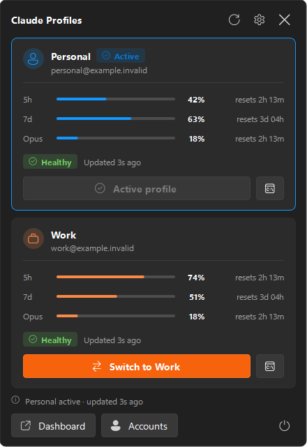

<div align="center">


# Claude Profiles

**Run two Claude Code accounts on Windows without the log-out/log-in dance.**
See both accounts' quota at a glance, switch in one click, or open a terminal bound to either one.


</div>

---

## Sound familiar?

If you use [Claude Code](https://docs.anthropic.com/en/docs/claude-code) with more than one account, such as
a personal subscription and a work one, you have probably hit some of these:

- **Claude Code only knows one account at a time.** Changing account means `/logout`, `/login`, a
  browser round-trip, and remembering which email you are in right now.
- **You hit the 5-hour limit halfway through a task**, and you cannot tell whether your *other*
  account has headroom without switching to it first.
- **Usage is invisible until it is a problem.** Your 5-hour and 7-day limits are checked one account at
  a time, so you find out you are at 95% when Claude stops answering.
- **You want both accounts at once**: one terminal on the work account and another on personal,
  without one login clobbering the other.
- **The tools that exist don't fit Windows.** [claude-swap](https://github.com/realiti4/claude-swap)
  solves the credential side well, but it is a CLI. The polished multi-profile usage trackers are
  macOS apps.

**Claude Profiles is a small Windows tray app that fixes all of the above.** It puts both accounts'
usage in your notification area. Switching is one click, and it can open a terminal locked to
either account. It never touches your credentials itself.

<div align="center">

<br><sub>Left-click the tray icon for the compact flyout.</sub>
</div>

## Features

| | |
|---|---|
| 📊 **Both accounts at a glance** | 5-hour and 7-day usage with reset countdowns, per-model rows (e.g. Opus), a pace indicator ("ahead of pace, expected 57%"), data age, and login health. |
| 🔁 **One-click switching** | Changes the account Claude Code uses for **new** sessions. The controls lock while the switch runs, and a Windows notification confirms the result. |
| 🖥️ **Isolated sessions** | Open a Claude Code terminal bound to one account *without* changing the global active account, so you can run both side by side. |
| 🪟 **A proper Windows tray app** | Monochrome Fluent glyph that follows your taskbar theme, with a coloured badge for the active profile. Left-click for the flyout; right-click for a native menu. |
| 🧭 **Full dashboard** | WinUI-style navigation with Overview, Accounts, Activity, Privacy and Settings pages. It follows your Windows accent colour and uses Segoe Fluent Icons. |
| 🧑‍💻 **Guided account setup** | The Accounts page walks you through signing in and registering each account, and shows exactly which address you are about to register. |
| 🔔 **Threshold alerts** *(opt-in)* | Notifies you when usage crosses a warning or critical level. It fires once per crossing and re-arms after the reset. |
| ⌨️ **Global shortcuts** *(opt-in)* | `Ctrl+Alt+1` for Personal, `Ctrl+Alt+2` for Work. |
| ⚡ **Smart refresh** | Opening the flyout refreshes it. Polling speeds up to 30 s while a window is visible and backs off automatically after errors. |
| 🚀 **Starts with Windows** | Adds a Start menu and Startup shortcut. No registry keys are written. |
| 🧪 **Demo mode** | `--mock` runs the whole UI on synthetic data. Useful for trying it before you set anything up. |
| 🔒 **Local-only by design** | No network code, no telemetry, and no credential access. See [Privacy and security](#privacy-and-security). |

### What it can and cannot switch

| | |
|---|---|
| ✅ Switches | The account Claude Code uses for **new** sessions, via claude-swap. |
| ✅ Isolated sessions | `cswap run` opens a terminal bound to one account, leaving the global profile alone. |
| ❌ Does **not** switch | Your browser session on claude.ai. Signing in there is separate and unaffected. |
| ❌ Does **not** touch | Running Claude Code processes, VS Code, terminals, or open chats. Nothing is ever killed for you. |
| ⚠️ Needs a nudge | An already-open VS Code Claude panel may still show the previous account. Close and reopen that panel. |

## How it works

Claude Profiles is a presentation layer on top of
**[claude-swap](https://github.com/realiti4/claude-swap)** (`cswap`), which does the actual account
storage, switching and quota fetching. The app runs `cswap` as a subprocess, parses its JSON output,
and draws it.

```
 Tray icon / flyout / dashboard
              │
        ProfileService ── polling, switching, activity log
              │
         CswapClient   ── allowlisted commands only, never a shell
              │
            cswap      ── owns your credentials; Claude Profiles never does
```

This split is deliberate: the app contains no OAuth logic, no token parsing, no credential backups,
and no writes to `.credentials.json`. See [`docs/architecture.md`](docs/architecture.md) for the
details.

---

## Getting started

### Prerequisites

- Windows 10 or 11
- Python 3.12 or newer
- [uv](https://docs.astral.sh/uv/) (or pipx) to install claude-swap
- [Claude Code](https://docs.anthropic.com/en/docs/claude-code), signed in to at least one account

### 1. Install claude-swap

```powershell
uv tool install claude-swap
# or: pipx install claude-swap
cswap --version
```

If `cswap` is not found afterwards, make sure `%USERPROFILE%\.local\bin` is on your `PATH`.

### 2. Get Claude Profiles running

```powershell
git clone https://github.com/kevinabouhanna/claude-profiles-windows.git
cd claude-profiles-windows

uv venv
uv pip install -e .

.venv\Scripts\python.exe -m claude_profiles
```

The tray icon appears in the notification area. Left-click it for the compact view.

> **Just want a look first?** Run `.venv\Scripts\python.exe -m claude_profiles --mock` to explore
> everything with synthetic data. No accounts are read or changed.

Windows 11 hides new tray icons by default. To keep this one visible, go to **Settings >
Personalisation > Taskbar > Other system tray icons** and switch on *Claude Profiles*.

### 3. Register your two accounts

**You can do this inside the app.** Open the **Accounts** page from the tray menu, or click
*Set up Personal…* on an unregistered profile card. For each account:

1. **Sign in.** The button opens a terminal running Claude Code. Sign in there (type `/login` to change
   account), close it, then press **Re-check**.
2. **Register.** The page shows which address Claude Code is signed in as right now. Confirm it and
   store it as Personal or Work.

If an account was registered under the wrong name, the bottom of the page re-points it instead of
adding it twice.

<details>
<summary>The equivalent terminal commands, if you prefer</summary>

```powershell
claude                      # sign in as the first account, then exit
cswap add --alias personal

claude                      # sign in as the second account, then exit
cswap add --alias work

cswap list                  # both accounts should appear with their aliases
cswap alias 1 personal      # to re-point an existing account
```
</details>

The aliases `personal` and `work` are the only account identifiers Claude Profiles stores. Email
addresses are read from `cswap list --json` at runtime and never written into source or config.

### Demo scenarios

```powershell
.venv\Scripts\python.exe -m claude_profiles --mock
.venv\Scripts\python.exe -m claude_profiles --scenario work_reauth
```

Scenarios: `healthy`, `work_reauth`, `work_stale`, `work_unavailable`, `high_usage`, `no_accounts`,
`unknown_schema`.

---

## Settings

| Setting | Default | Notes |
|---|---|---|
| Refresh interval | 120 s | Used while the app is in the tray. Polls never overlap and back off automatically after errors. |
| Launch at Windows sign-in | **On** | Creates a shortcut in your Startup folder. **No registry keys are ever written.** Turning it off deletes the shortcut. |
| Threshold notifications | Off | Fires on an upward crossing only, and re-arms after a reset. |
| Global shortcuts | Off | `Ctrl+Alt+1` Personal, `Ctrl+Alt+2` Work. Registered only when enabled. |

Switch confirmations always appear, regardless of the notification setting, because they are the
direct result of something you clicked.

### When usage refreshes

You should rarely need the Refresh button:

- **Opening the flyout or the dashboard refreshes it**, unless a reading arrived in the last 10 seconds.
- **Polling speeds up while you are looking.** With a window on screen the interval drops to 30
  seconds, then returns to your configured interval once everything is hidden.
- **After a switch**, state is re-read immediately.

## When an account needs re-authentication

If claude-swap reports `token_expired`, `relogin_required`, or `no_credentials`, the card shows
**Re-authentication required**. The fix is manual by design:

1. Open the **Accounts** page and press **Open a terminal to sign in to Claude Code**.
2. Sign in as that account, close the terminal, and press **Re-check**.
3. Press **Register as Personal** / **Register as Work** to refresh the stored slot.

The equivalent by hand is `claude` to sign in, then `cswap add --alias <alias>`. The app will never
try to automate authentication in the background.

---

## Privacy and security

- **Local only.** The app opens no network connections. Its only external interaction is running
  the local `cswap` executable and parsing the JSON it prints.
- **No credential access.** `%USERPROFILE%\.claude\.credentials.json`, `.claude-swap-backup\`, and
  Claude Code session files are never read, written, copied, exported, or backed up.
- **Allowlisted commands.** Only `cswap list`, `status`, `switch`, `run`, `add`, and `alias` can be
  invoked. There is no free-form command path, argv is always a list, and a shell is never used.
  `remove`, `purge`, `export`, `import`, `add-token`, and `config` are all refused.
- **Setup is not authentication.** `add` only records the account Claude Code is *already* signed
  in as. Signing in stays an interactive step you perform yourself.
- **No raw output is logged.** `cswap` stdout and stderr never reach a log or the UI. Only parsed,
  redacted error fields do.
- **Redaction everywhere.** Anything written to disk passes through a scrubber for API keys, JWTs,
  bearer tokens and `token=`/`secret=` assignments. Email addresses are masked.
- **No telemetry**, analytics, crash reporting, cloud sync, or remote configuration.
- **Restricted storage.** `%LOCALAPPDATA%\ClaudeProfiles\` is locked to your user account on
  creation. It holds only UI preferences, aliases, and a capped activity history.

The in-app **Privacy** page says the same, and has **Open data folder** and **Clear local activity
history** buttons. See [`docs/privacy.md`](docs/privacy.md) for the full data inventory.

---

## Building a standalone app

The packaged build behaves like an ordinary Windows application: a windowed binary with its own
icon that never opens a console.

```powershell
uv pip install -r requirements-dev.txt

.venv\Scripts\python.exe tools\make_icon.py           # render the .ico first
.venv\Scripts\pyinstaller.exe claude_profiles.spec     # -> dist\Claude Profiles\
.venv\Scripts\python.exe tools\verify_build.py        # prove the build actually runs

Copy-Item "dist\Claude Profiles" "$env:LOCALAPPDATA\Programs\" -Recurse -Force
& "$env:LOCALAPPDATA\Programs\Claude Profiles\ClaudeProfiles.exe"
```

On first run the app points its Start menu and Startup shortcuts at wherever it is installed. The
build bundles the UI only, so you still need `cswap` installed separately, because credential
handling deliberately stays outside this application.

<details>
<summary>Why the build is set up this way</summary>

- **One folder, not one file.** A one-file build re-extracts ~45 MB to a temp directory on every
  launch and leaves a bootloader process beside the real one.
- **The icon is rendered before the build.** Drawing it needs a `QPixmap`, and creating one without
  a `QGuiApplication` aborts the process. Inside a `.spec` that looks like PyInstaller crashing
  at the PYZ stage with no error.
- **`verify_build.py` is not optional.** A broken build can still look healthy from the outside,
  so it checks that the app reached its own code, not just that a process exists.
- **uv's `pythonw.exe` is not windowed.** A `.venv` created by uv ships a `pythonw.exe` that is a
  console-subsystem trampoline, so running the app through it opens a terminal. The app detects
  this and points its shortcuts at the installed build, or at a genuinely windowed interpreter.
</details>

## Development

```powershell
uv pip install -r requirements-dev.txt
.venv\Scripts\python.exe -m pytest -q
.venv\Scripts\python.exe -m ruff check .

# Optional: check the live claude-swap contract. Read-only; never switches,
# adds or aliases anything. Worth running after upgrading claude-swap.
.venv\Scripts\python.exe -m pytest --run-integration -m integration
```

See [`docs/development.md`](docs/development.md) and [`docs/architecture.md`](docs/architecture.md).
Issues and pull requests are welcome.

---

## Credits

Claude Profiles would not exist without these projects. Thank you to their authors.

- **[realiti4/claude-swap](https://github.com/realiti4/claude-swap)** (MIT) is the engine underneath.
  It handles account storage, switching, isolated sessions and quota fetching. Claude Profiles
  runs it as a subprocess; **no code is copied**. If this app is useful to you, go star that repo.
- **[jens-duttke/usage-monitor-for-claude](https://github.com/jens-duttke/usage-monitor-for-claude)**
  (MIT) was the reference for Windows tray behaviour, adaptive polling and privacy practice.
  **No code copied.**
- **[hamed-elfayome/Claude-Usage-Tracker](https://github.com/hamed-elfayome/Claude-Usage-Tracker)**
  (MIT) was the UX reference for presenting multiple profiles. It is a macOS Swift app; **no code
  ported**.
- Built with **[PySide6 / Qt for Python](https://doc.qt.io/qtforpython-6/)** and packaged with
  **[PyInstaller](https://pyinstaller.org/)**.

No source from these projects is included here, so no third-party notices are bundled. Their licences
were checked before implementation.

## Licence

MIT. See [`LICENSE`](LICENSE).

*Claude Profiles is an independent community project. It is not affiliated with, endorsed by, or
supported by Anthropic. "Claude" and "Claude Code" are trademarks of Anthropic, PBC.*
